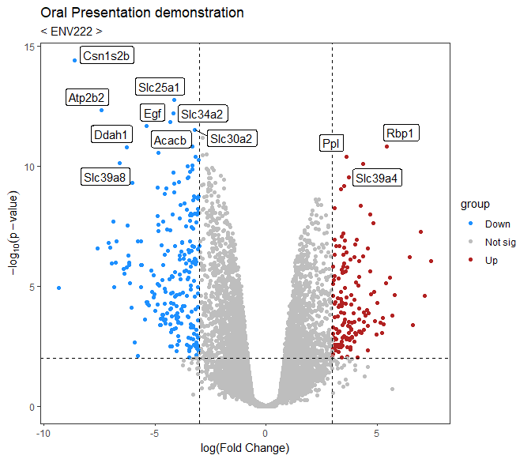

```{r setup, include=FALSE}
options(htmltools.dir.version = FALSE)
knitr::opts_chunk$set(
  fig.width=9, fig.height=3.5, fig.retina=3,
  out.width = "100%",
  cache = FALSE,
  echo = TRUE,
  message = FALSE, 
  warning = FALSE,
  hiline = TRUE
)
```

```{r xaringan-themer, include=FALSE, warning=FALSE}
library(xaringanthemer)
style_duo_accent(
  primary_color = "#1381B0",
  secondary_color = "#FF961C",
  inverse_header_color = "#FFFFFF"
)
```

### The detailed steps involved in *Next-Generation Sequencing*:

1. <font size="4.5">To <font color=orange><b>prepare the library</b></font>, fragments of DNA or RNA are size-selected and ligated to adapters that enable them to bind to the sequencing platform. This step is crucial for generating high-quality reads.</font>
2. <font size="4.5"><font color=orange><b>Quality control</b></font> involves assessing the quality of the prepared library using various metrics such as concentration, purity, fragment size distribution, and quality scores. Only libraries that pass this assessment are sequenced.</font>
3. <font size="4.5"><font color=orange><b>Sequencing</b></font> involves loading the library onto a sequencer which simultaneously sequences millions of DNA or RNA fragments using technologies like Illumina, Ion Torrent, and PacBio.</font>
4. <font size="4.5"><font color=orange><b>Data processing</b></font> is necessary to remove adapter sequences, low-quality reads and contaminations from raw sequencing data generated by the sequencer in order to ensure accuracy in downstream analyses.</font>
5. <font size="4.5"><font color=orange><b>Alignment</b></font> requires specialized software such as Bowtie, BWA STAR or HISAT2 to align processed reads with a reference genome or transcriptome resulting in a BAM file containing genomic coordinates of aligned reads.</font>
6. <font size="4.5"><font color=orange><b>Variant calling</b></font> uses software like GATK or FreeBayes on aligned reads to identify variants including single-nucleotide polymorphisms (SNPs) and insertions/deletions (indels).</font>
7. <font size="4.5"><font color=orange><b>Differential expression analysis</b></font> quantifies gene expression levels using software such as HTSeq or FeatureCounts before analyzing expression data with DESeq2 or edgeR for identifying differentially expressed genes between experimental conditions.</font>
8. <font size="4.5"><font color=orange><b>Functional analysis</b></font> annotates and analyzes differentially expressed genes for determining their biological functions, signaling pathways and potential disease associations critical for understanding experimental results' biological relevance.</font>
9. <font size="4.5"><font color=orange><b>Visualization & interpretation</b></font> involve visualizing & interpreting functional analysis results using appropriate tools such as <font color=red><u>volcano plot</u></font> which can help us to visualize differential gene expression.</font>

---

## Paper from NCBI:

.left-column[
*<font color=green>Click the picture to open link of the NCBI paper:</font>*
]

.right-column[
[](https://pubmed.ncbi.nlm.nih.gov/28096348/)
]

**[Topic]** Transcriptomic, proteomic, and metabolomic landscape of positional memory <br>
            in the caudal fin of zebrafish

---

## High throughput data
Often, after a genetic biology experiment, we have a large number of data sets that we need to filter, and the most convenient way to do this is to use the P-value.

## Visualization using Volcano Plot
Using the volcano plot we can visualize the data with significant differences and have the flexibility to adjust the thresholds to suit the needs of the experiment. Here are some detailed explanations of the steps taken in the analysis of biological experimental data Source.

- Visualization of RNA-Seq results with Volcano Plot **[paper]**: [Visualization of RNA-Seq results with Volcano Plot](https://training.galaxyproject.org/training-material/topics/transcriptomics/tutorials/rna-seq-viz-with-volcanoplot/tutorial.html)

- Volcano plots with ggplot2 for differential gene expression **[video]**:
[Volcano plots with ggplot2 for differential gene expression](https://www.youtube.com/watch?v=sIRnaKo1aKE)

---

# Steps for differential gene detection

.left-column[
## First
## Second
## Third
]

.right-column[
- <font color=Red>[Preparing the inputs]</font> Differential expressed results file (genes in rows, and 4 required columns: raw *P values*, *adjusted P values (FDR)*, *log fold change* and *gene labels*).
- <font color=Red>[Create volcano plot]</font> Create a volcano plot coloring all significant genes. Typically, we will call genes significant here if FDR < 0.01 and a log10 fold change of 3. These were the values used in the original paper for this dataset. Often, label the top 10 most significant genes with their gene names.
- <font color=Red>[Conclusion]</font> The up-regulated differential genes and the down-regulated differential genes which was derived from the volcano plot then can be used for subsequent data analysis and comparison.
]

---

## Example(Find significant difference genes):
```{r eval=FALSE}
# import the dataset
> df <- read.csv("volcano_plot_example_data.csv",
                 header = TRUE, stringsAsFactors = FALSE)
                 
# Preview the data structure                 
> head(df)
  gene_name     logFC      P.Value    adj.P.Val
1   Csn1s2b -8.603611 3.830650e-15 6.053959e-11
2   Slc25a1 -4.124175 1.758595e-13 1.389642e-09
3    Atp2b2 -7.386986 4.836363e-13 2.432800e-09
4   Slc34a2 -4.177812 6.157428e-13 2.432800e-09
5     Acacb -4.314320 1.499977e-12 4.741129e-09
6       Egf -5.362664 2.116244e-12 5.574188e-09

# View the size of the dataset
> dim(df)
15641     4
```

<font color=Orange>This CSV file is extremely large in data. It contains the four attributes gene name, log(fold change), P-value, adjusted P-value.</font> 

---

## Data classification
```{r eval=FALSE}
# Split the dataset and create a new column 'group'
> df$group <- ifelse(df$logFC>=3&df$P.Value<=0.01, "Up", 
                     ifelse(df$logFC<=-3&df$P.Value<=0.01, "Down", "Not sig"))

# Result
> table(df$group)
   Down  Not sig    Up 
    228   15257     156 
```
<br><font color=Orange>Transcripts were considered differentially expressed at *FDR < 1%* and *fold change > 3* between proximal and distal regions, whereas proteins were considered differentially expressed at *FDR < 5%* and *fold change > 2*.</font> <br><br>Here this dataset is a trans group so we use *log(fold change)>3* and *P-value<0.01* to split the dataset into three main parts, which are *Not significant*, *Up-regulated genes* and *Down-regulated genes*.

---

## Get the new dataset
```{r eval=FALSE}
# Create the column 'pvalue_log10' then insert it into the table
> df$pvalue_log10 <- (-log10(df$P.Value))
> df_sig <- df[df$pvalue_log10>=10,]
> head(df_sig)
  gene_name     logFC      P.Value    adj.P.Val group pvalue_log10
1   Csn1s2b -8.603611 3.830650e-15 6.053959e-11  Down     14.41673
2   Slc25a1 -4.124175 1.758595e-13 1.389642e-09  Down     12.75483
3    Atp2b2 -7.386986 4.836363e-13 2.432800e-09  Down     12.31548
4   Slc34a2 -4.177812 6.157428e-13 2.432800e-09  Down     12.21060
5     Acacb -4.314320 1.499977e-12 4.741129e-09  Down     11.82392
6       Egf -5.362664 2.116244e-12 5.574188e-09  Down     11.67443

# Get the significant gene
> dim(df_sig)
 21  6
```
<font color=Orange>Typically, we add log10() to the P-value so that we can get a more intuitive, linear data set that is easier to observe and analyse.</font> <br>Here we use log10(P-value)>=10 to the Significance criteria.

---

## Charting
```{r eval=FALSE}
# Importing those packages we need
library(ggplot2)
library(ggrepel)

# Draw the volcano plot
ggplot(df, aes(x=logFC, y=-log10(P.Value))) + geom_point(aes(color=group)) +
  scale_color_manual(values=c("dodgerblue", "gray", "firebrick")) +
  geom_label_repel(data=df_sig,aes(x=logFC, y=-log10(P.Value), label=gene_name)) +
  labs(title = "Oral Presentation", subtitle = "< ENV222 >", 
       caption ="[Volcano plot R-demo for bioinformatics]", 
       y="-log10(p-value)", x="log(Fold Change)") +
  theme_bw()
```
<br>Set *logFC* as x_lab and *-log10(P.Value)* as y_lab. <br>Also, use different <font color=Red>colors</font> to represent groups and add some <font color=Red>annotations</font> for those significant genes. <br>By and large, some further diagrammatic <font color=Red>touches</font> are necessary.

---

### Full code
```{r eval=FALSE}
# dev.new()
getwd()

df <- read.csv("volcano_plot_example_data.csv",
               header = TRUE, stringsAsFactors = FALSE)
head(df)
dim(df)
df$group <- ifelse(df$logFC>=3&df$P.Value<=0.01, "Up", 
                   ifelse(df$logFC<=-3&df$P.Value<=0.01, "Down", "Not sig"))
table(df$group)
df$pvalue_log10 <- (-log10(df$P.Value))
df_sig <- df[df$pvalue_log10>=10,]
head(df_sig)
dim(df_sig)
library(ggplot2)
library(ggrepel)
ggplot(df, aes(x=logFC, y=-log10(P.Value))) + geom_point(aes(color=group)) +
  scale_color_manual(values=c("dodgerblue", "gray", "firebrick")) +
  geom_label_repel(data=df_sig,aes(x=logFC, y=-log10(P.Value), label=gene_name)) +
  labs(title = "Oral Presentation", subtitle = "< ENV222 >", 
       caption ="[Volcano plot R-demo for bioinformatics]", 
       y="-log10(p-value)", x="log(Fold Change)") +
  theme_bw()
```

---

### Result

<center>[](https://i.ibb.co/C9sbPM7/Rplot.png)

---

class: inverse center middle

# [The end of the presentation]
## 😃 Thanks!
